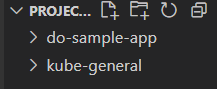
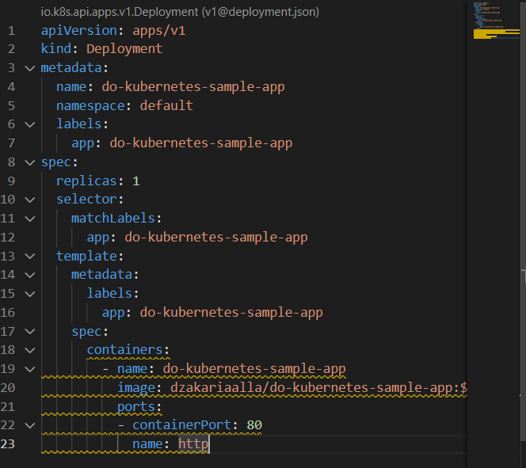

<h1>Cloud Project</h1>

## Contents
- [Part 1 : How To Build a Node.js Application with Docker](#part-1-how-to-build-a-node.js-application-with-docker)
    - [Step 1 - Installing our   Application Dependencies](#step-1-installing-our-application-dependencies)

## Part 1 : How To Build a Node.js Application with Docker
### Step 1 - Installing our   Application Dependencies
I first need to make the application files, which I can then copy to my container. These files will include the application’s static content, code, and dependencies.

### Step 2 — Creating the Application File
This is the structure of the project.

  

### Step 3 — Writing the Dockerfile
My Dockerfile specifies what will be included in the application container when it is executed. Using a Dockerfile allows me to define my container environment and avoid discrepancies with dependencies or runtime versions.

  

### Step 4 — Using a Repository to Work with Image
By pushing the application image to my DockerHub registry, I make it available for subsequent use as I build and scale the containers.

  

## Part 2 : Containerizing a Node.js Application for Development With Docker Compose
### Step 1 — Cloning the Project and Modifying Dependencies
First, I clone the nodejs-mongo-mongoose repository. This repository includes the code from the setup described in How To Integrate MongoDB with my Node Application, which explains how to integrate a MongoDB database with an existing Node application using Mongoose.

  

### Step 2 — Configuring our Application to Work with Containers
In this step I will refactor and make some changes to the code.

  

### Step 3 — Modifying Database Connection Settings
In the next step I make our database connection method more robust by adding code that handles cases where our application fails to connect to our database.

  

### Step 4 — Defining Services with Docker Compose
Now I am ready to write the docker-compose.yml file with the service definitions.

  

### Step 5 — Testing the Application
After building the container images and create the services by running `docker compose  up`

  

## Part 3 : How To Migrate a Docker Compose Workflow to Kubernetes
### Step 1 — Installing kompose
The first step is to install kompose.

  

### Step 2 — Cloning and Packaging the Application
To use the application with Kubernetes, I need to clone the project code and package the application so that the kubelet service can pull the image.

  

### Step 3 — Translating Compose Services to Kubernetes Objects with kompose
Convert our   service definitions to yaml files with the following command : `kompose convert`

  

### Step 4 — Creating Kubernetes Secrets
I need to make a few modifications to the files that kompose has created.

* `secret.yaml`
* `nodejs-deployment.yaml`
* `db-deployment.yaml`

### Step 5 — Creating the Database Service and an Application Init Container
We can move on to creating the database Service and an Init Container that will poll this Service to ensure that our application only attempts to connect to the database once the database startup tasks.

  

### Step 6 — Modifying the PersistentVolumeClaim and Exposing the Application Frontend
Before running the application, I have to make two final changes to ensure that the database storage will be provisioned properly and that I can expose our application frontend using a LoadBalancer. 
We should check what is the right `storage` class by typing: `kubectl get storageclass`. 

  

### Step 7 — Starting and Accessing the Application
The final step is to create our Kubernetes objects and test that the application is working as expected.

  

  

## Part 4: How To Automate Deployments to Kubernetes with CircleCI
### Step 1 — Creating the Local Git Repository
The first step is to create a new Git repository locally that I  will push to GitHub later. Create two folder `do-sample-app`, `kube-general`.

  

### Step 2 — Creating a Service Account
I create the Service Account on the cluster by running `kubectl apply`, like the following: `kubectl apply -f ~/kube-general/`. 
We will recieve output similar to the following:

  

### Step 3 — Creating the Role and the Role Binding
Create the file `~/kube-general/cicd-role.yml`.

  

### Step 4 — Creating our   Sample Application
create a new `index.html` `Dockerfile` and build the image.

  

### Step 5 — Creating the Kubernetes Deployment and Service
Create	the	YAML	deployment	file `~/do-sample-app/kube/do-sample- deployment.yml`

  

### Step 6 — Configuring CircleCI
Access to `CircleCI` and create an account, configure it with our `github` account.

  

### Step 7 — Updating the Deployment on the Kubernetes Cluster
Change the deployment manifest file, then create the image and push all.

  

## Part 5: How to Set Up Kubernetes Cluster Monitoring with Helm and Prometheus Operator
### Step 1 — Creating a Custom Values File
I have to create a custom values file that will override some of the chart’s defaults with specific configuration parameters.

  

### Step 2 — Installing the prometheus-operator Chart
On my local machine, I have to install the `prometheus-operator` Helm chart and passing in the custom values file.

  

### Step 3 — Accessing Grafana and Exploring Metrics Data
The `prometheus-operator` Helm chart exposes Grafana as a `ClusterIP` Service, which means that it’s only accessible via a `cluster-internal IP address`. 

  

### Step 4 — Accessing Prometheus and Alertmanager
To connect to the `Prometheus Pods`, we have to use `kubectl port-forward` to forward a local port.

  

